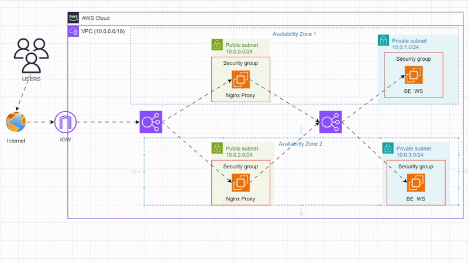
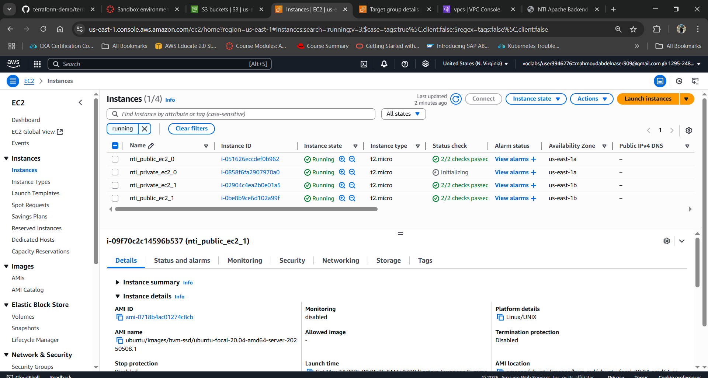
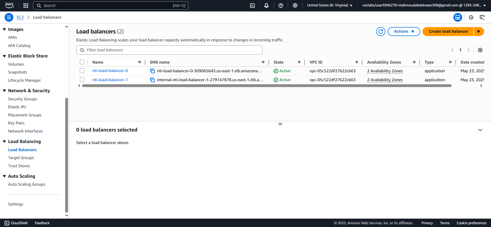
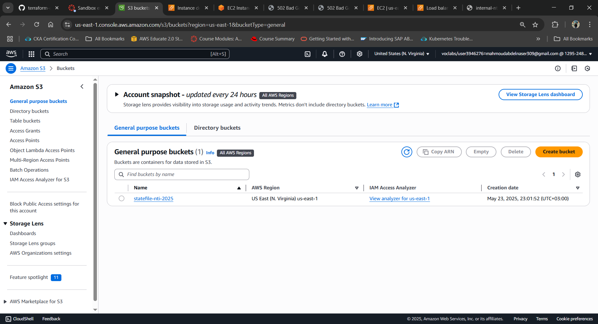
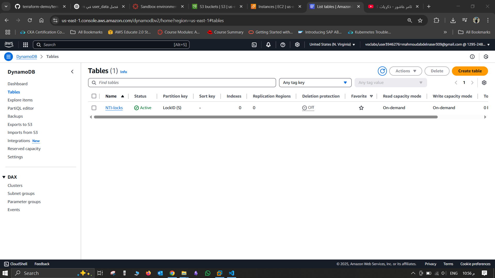
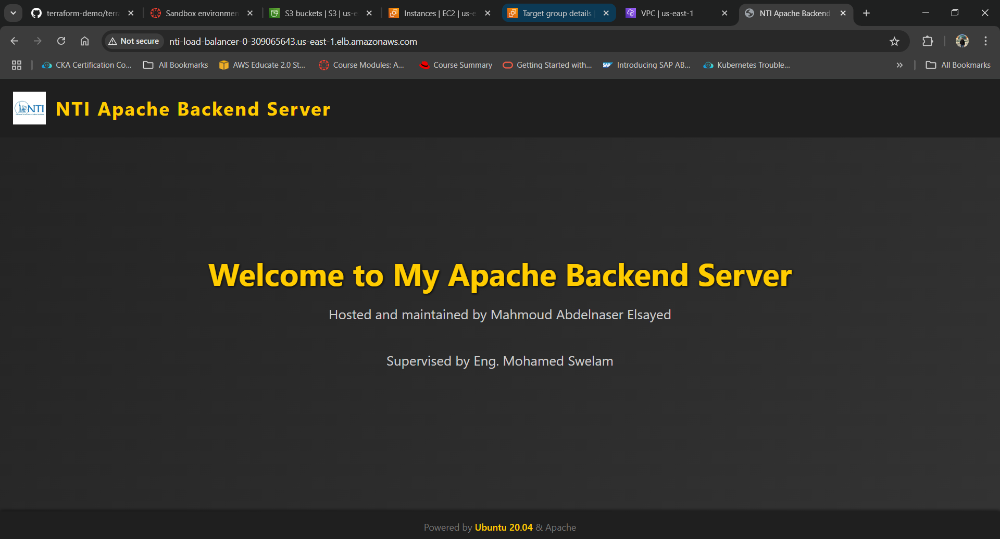

# 🛠️ NTI Cloud Infrastructure Project

This project uses **Terraform** to provision a complete cloud infrastructure on **AWS**, including networking, compute, and load balancing components. It is developed as part of the **NTI Cloud DevOps Accelerator Program**.

## 📦 Project Structure

```
.
├── backend.tf                 # Remote backend (S3 + DynamoDB) setup
├── main.tf                   # Root module
├── variables.tf              # Root-level variables
├── terraform.tfvars          # Variable values
├── all-ips.txt               # Local output of created EC2 IPs
├── my-key.pem                # SSH key (optional; do not commit to GitHub)
├── modules/
│   ├── ec2/
│   │   ├── main.tf
│   │   ├── outputs.tf
│   │   ├── private.sh
│   │   ├── public.sh.tpl
│   │   └── variables.tf
│   ├── loadbalancer/
│   ├── subnet/
│   └── vpc/
└── .terraform/               
```

---
## Architecture Diagrams


### EC2 Instances


### Load Balancer


### S3 State File


### DynamoDB Lock Table


### Website View



---

## 🚀 What It Does

- **Creates a VPC** with public and private subnets.
- **Launches EC2 instances** in both subnet types:
  - Public EC2s with NGINX as a reverse proxy to the private backend.
  - Private EC2s running Apache, serving a styled web page.
- **Configures a Load Balancer** that distributes traffic to the private instances.
- **Uses a remote backend** (S3 + DynamoDB) for Terraform state and locking.
- Outputs all instance private IPs to `all-ips.txt`.

---

## ⚙️ Requirements

- Terraform v1.0+
- AWS CLI configured (`aws configure`)
- AWS account with IAM user access

---

## 📁 Setup Instructions

1. **Clone the repo**

```bash
git clone https://github.com/mahmoudAbdelnaser99/NTI-terraform-aws.git

```

2. **Initialize Terraform**

```bash
terraform init
```

3. **Review the plan**

```bash
terraform plan
```

4. **Apply the infrastructure**

```bash
terraform apply
```

5. **Destroy the infrastructure when done**

```bash
terraform destroy
```

---

## 🧾 Notes

- The `public.sh.tpl` uses a template to inject the private Load Balancer DNS into the NGINX proxy configuration.
- Do not commit `my-key.pem` or `.terraform/` directory to version control.
- Make sure to update `terraform.tfvars` with your custom values.

---

## 👤 Author

**Mahmoud Abdelnaser Elsayed**  
Cloud DevOps Accelerator @ NTI  
Supervised by: **Eng. Mohamed Swelam**

---


